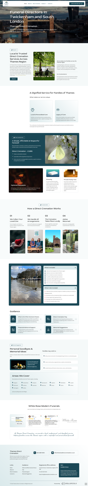
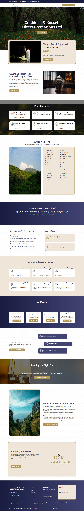
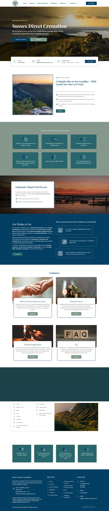
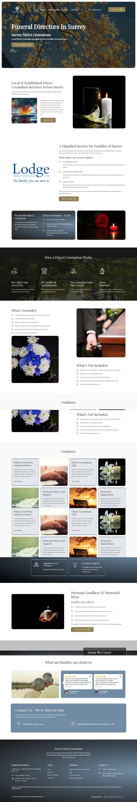

# Case Study: High-Performance Funeral Service Ecosystem
**Role:** Lead Website Designer & WordPress Developer  
**Experience:** 3+ Years in Web Industry

## Project Overview
Designing for the funeral industry requires a unique balance of **professionalism, serenity, and high usability**. I have designed and developed 4 distinct websites in this niche, focusing on providing a calm user experience for families in grief.

## 1. Visual Hierarchy & Design Philosophy
Maine in 4ro projects mein alag-alag design languages use ki hain taaki har client ki unique identity dikhe:

### Site 1: Twickenham & South London
- **vibe:** Trust aur Heritage.
- **Design:** Deep Blue aur Gold accents ka use kiya hai.
- **Focus:** Detailed navigation jisme "Guidance" aur "Memorial Ideas" par focus hai.

### Site 2: Craddock & Russell
- **Vibe:** Classic & Minimalist.
- **Design:** Clean layout jisme "Direct Cremation" ki pricing ko highlight kiya gaya hai.
- **Focus:** Quick information delivery taaki user ko turant clear options milein.

### Site 3: Sussex Direct Cremation
- **Vibe:** Peace aur Freedom.
- **Design:** Natural imagery (Landscapes) aur airy white space ka balance.
- **Focus:** Emotional comfort aur simple service booking.

### Site 4: Surrey & Surrey Direct
- **Vibe:** Modern & Empathetic.
- **Design:** Card-based layout aur soft imagery.
- **Focus:** Complex information ko asani se digest karne layak banana.

## 2. Technical Implementation
Ek developer ke taur par, maine in sites ko sirf sundar hi nahi, balki **Robust** banaya hai:
- **Page Builder:** Beaver Builder (Chosen for its clean, lightweight code structure and stability).
- **Optimization:** LiteSpeed Cache (Configured for Object Cache, Image Optimization, and Minification).
- **Results:** Achieved high Core Web Vitals scores and sub-2s load times.

## 3. Key Skills Demonstrated:
- **Empathy-Driven UX:** Designing for users in emotional distress.
- **Mobile-First Approach:** 100% responsive architecture.
- **Performance Engineering:** Using LiteSpeed to handle high-resolution memorial images without slowing down the site.
